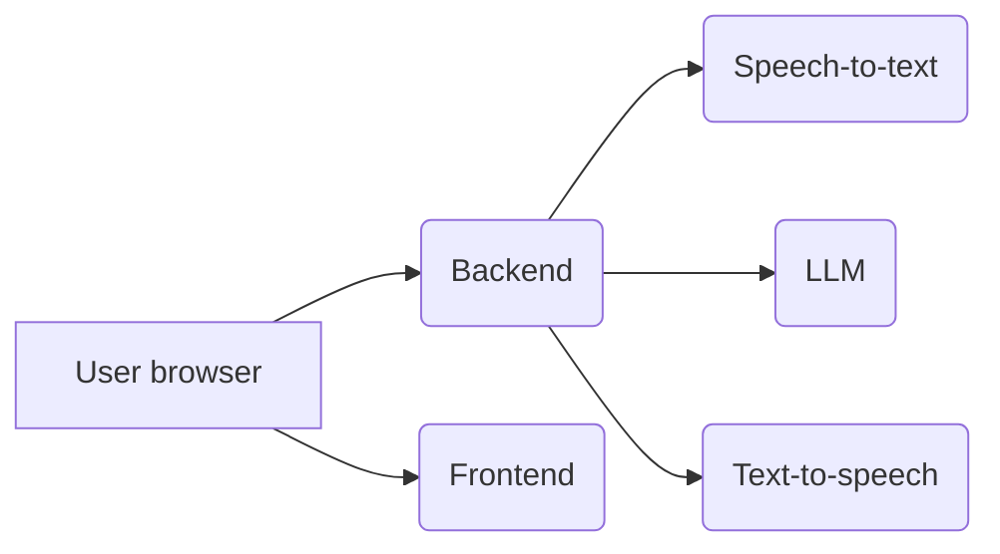
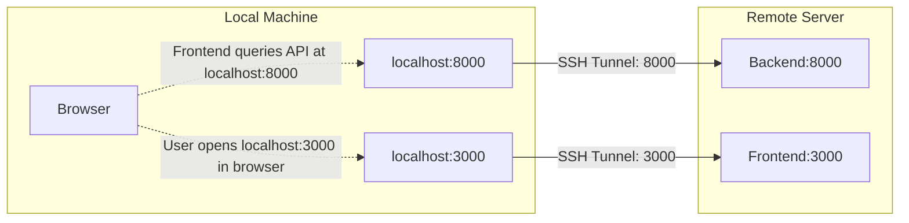

# Unmute

Try it out at [Unmute.sh](https://unmute.sh)!

Unmute is a system that allows text LLMs to listen and speak by wrapping them in Kyutai's Text-to-speech and Speech-to-text models.
The speech-to-text transcribes what the user says, the LLM generates a response in text, and the text-to-speech reads it out loud.
Both the STT and TTS are optimized for low latency and the system works with any text LLM you like.

If you want to use Kyutai STT or Kyutai TTS separately, check out [kyutai-labs/delayed-streams-modeling](https://github.com/kyutai-labs/delayed-streams-modeling).
A pre-print about the models is available [here](https://arxiv.org/pdf/2509.08753).

On a high level, it works like this:



- The user opens the Unmute website, served by the **frontend**.
- By clicking "connect", the user establishes a websocket connection to the **backend**, sending audio and other metadata back and forth in real time.
  - The backend connects via websocket to the **speech-to-text** server, sending it the audio from the user and receiving back the transcription in real time.
  - Once the speech-to-text detects that the user has stopped speaking and it's time to generate a response, the backend connects to an **LLM** server to retrieve the response. We host our own LLM using [VLLM](https://github.com/vllm-project/vllm), but you could also use an external API like OpenAI or Mistral.
  - As the response is being generated, the backend feeds it to the **text-to-speech** server to read it out loud, and forwards the generated speech to the user.

## Setup

> [!NOTE]
> If something isn't working for you, don't hesistate to open an issue. We'll do our best to help you figure out what's wrong.

Requirements:
- Hardware: a GPU with CUDA support and at least 16 GB VRAM. Architecture must be x86_64, no aarch64 support is planned.
- OS: Linux, or Windows with WSL ([installation instructions](https://ubuntu.com/desktop/wsl)). Running on Windows natively is not supported (see [#84](https://github.com/kyutai-labs/unmute/issues/84)). Neither is running on Mac (see [#74](https://github.com/kyutai-labs/unmute/issues/74)).

We provide multiple ways of deploying your own [unmute.sh](unmute.sh):

| Name                      | Number of gpus | Number of machines | Difficulty | Documented | Kyutai support |
|---------------------------|----------------|--------------------|------------|------------|----------------|
| Docker Compose            | 1+             | 1                  | Very easy  |✅         |✅              |
| Dockerless                | 1 to 3         | 1 to 5             | Easy       |✅         |✅              |
| Docker Swarm              | 1 to ~100      | 1 to ~100          | Medium     |✅         |❌              |


Since Unmute is a complex system with many services that need to be running at the same time, we recommend using [**Docker Compose**](https://docs.docker.com/compose/) to run Unmute.
It allows you to start or stop all services using a single command.
Since the services are Docker containers, you get a reproducible environment without having to worry about dependencies.

While we support deploying with Docker compose and without Docker, the Docker Swarm deployment is only given to show how we deploy and scale [unmute.sh](unmute.sh). It looks a lot like the compose files, but since debugging multi-nodes applications is hard, we cannot help you debug the swarm deployment.

### Quick Setup

Run the interactive setup script to configure your environment:

**Windows (in WSL):**
```bash
./setup.sh
```

**Linux/WSL:**
```bash
./setup.sh
```

The script will prompt you for:
1. Your Hugging Face token (required for STT/TTS models - get one at [huggingface.co/settings/tokens](https://huggingface.co/settings/tokens))
2. Your LLM backend choice (Koboldcpp, Ollama, OpenAI, or custom)

This creates a `.env` file with your configuration.

### Manual Configuration

Alternatively, configure manually:

```bash
cp .env.example .env
# Edit .env and set your HUGGING_FACE_HUB_TOKEN and LLM settings
```

### Start Unmute

Make sure you have [**Docker Compose**](https://docs.docker.com/compose/) installed.
You'll also need the [NVIDIA Container Toolkit](https://docs.nvidia.com/datacenter/cloud-native/container-toolkit/latest/install-guide.html) to allow Docker to access your GPU.
To make sure the NVIDIA Container Toolkit is installed correctly, run:
```bash
sudo docker run --rm --runtime=nvidia --gpus all ubuntu nvidia-smi
```

The STT and TTS services require approximately 8GB of GPU memory combined.
If you're running into memory issues, open `docker-compose.yml` and look for `NOTE:` comments to see places that you might need to adjust.

**Step 1: Start your LLM server**

Before running Unmute, start an LLM server on your host machine. The simplest option is Koboldcpp:

```bash
# Download Koboldcpp and a GGUF model, then run:
./koboldcpp --model /path/to/your-model.gguf --port 5001 --usecublas
```

See [Using external LLM servers](#using-external-llm-servers) for other options (Ollama, OpenAI, etc.).

**Step 2: Start Unmute**

```bash
# If using .env file, just run:
docker compose up --build

# Or verify your environment variable is set:
echo $HUGGING_FACE_HUB_TOKEN  # Should print hf_...something...
```

The website should be accessible at `http://localhost` (port 80).
The LLM model name will be displayed in the UI header once connected.

#### Using multiple GPUs

On [Unmute.sh](https://unmute.sh/), we run the speech-to-text and text-to-speech on separate GPUs,
which improves the latency compared to a single-GPU setup.
The TTS latency decreases from ~750ms when running everything on a single L40S GPU to around ~450ms on [Unmute.sh](https://unmute.sh/).

Since the LLM runs externally on the host, you can dedicate GPU resources to the STT and TTS services.
If you have multiple GPUs available, you can configure them in `docker-compose.yml`:

```yaml
  stt: # Similarly for `tts`
    # ...other configuration
    deploy:
      resources:
        reservations:
          devices:
            - driver: nvidia
              device_ids: ['0']  # Use specific GPU
              capabilities: [gpu]
  tts:
    # ...other configuration
    deploy:
      resources:
        reservations:
          devices:
            - driver: nvidia
              device_ids: ['1']  # Use different GPU
              capabilities: [gpu]
```

Your external LLM server (Koboldcpp, Ollama, etc.) can use a third GPU if available.


### Running without Docker

Alternatively, you can choose to run Unmute by manually starting the services without going through Docker.
This can be more difficult to set up because of the various dependencies needed.

The following instructions only work for Linux and WSL.

#### Software requirements

* `uv`: Install with `curl -LsSf https://astral.sh/uv/install.sh | sh`
* `cargo`: Install with `curl https://sh.rustup.rs -sSf | sh`
* `pnpm`: Install with `curl -fsSL https://get.pnpm.io/install.sh | sh -`
* `cuda 12.1`: Install it with conda or directly from the Nvidia website. Needed for the Rust processes (tts and stt).

#### Hardware requirements

Start each of the services one by one in a different tmux session or terminal:
```bash
./dockerless/start_frontend.sh
./dockerless/start_backend.sh
./dockerless/start_llm.sh        # Needs 6.1GB of vram
./dockerless/start_stt.sh        # Needs 2.5GB of vram
./dockerless/start_tts.sh        # Needs 5.3GB of vram
```
And the website should be accessible at `http://localhost:3000`.

### Connecting to a remote server running Unmute

If you're running Unmute on a machine that you're accessing over SSH – call it `unmute-box`  – and you'd like to access it from your local computer,
you'll need to set up [port forwarding](https://www.ssh.com/academy/ssh/tunneling-example).

> [!NOTE]
> If you're running over HTTP and not HTTPS, you'll need to forward the ports even if `http://unmute-box:3000` is accessible directly.
> This is because browsers usually won't let you use the microphone on HTTP connections except for localhost, for security reasons.
> See below for HTTPS instructions.

**For Docker Compose**: By default, our Docker Compose setup runs on port 80.
To forward port 80 on the remote to port 3333 locally, use:

```bash
ssh -N -L 3333:localhost:80 unmute-box
```
If everything works correctly, this command will simply not output anything and just keep running.
Then open `localhost:3333` in your browser.

**For Dockerless**: You need to separately forward the backend (port 8000) and frontend (port 3000):

```bash
ssh -N -L 8000:localhost:8000 -L 3000:localhost:3000 unmute-box
```



### HTTPS support

For simplicity, we omit HTTPS support from the Docker Compose and Dockerless setups.
If you want to make the deployment work over the HTTPS, consider using Docker Swarm
(see [SWARM.md](/SWARM.md)) or ask your favorite LLM how to make the Docker Compose or dockerless setup work over HTTPS.


## Production deployment with Docker Swarm

If you're curious to know how we deploy and scale [unmute.sh](https://unmute.sh), take a look at our docs
on the [Docker Swarm deployment](./SWARM.md).

## Modifying Unmute

Here are some high-level pointers about how you'd go about making certain changes to Unmute.

### Subtitles and dev mode

Press "S" to turn on subtitles for both the user and the chatbot.

There is also a dev mode that can help debugging, but it's disabled by default.
Go to `useKeyboardShortcuts.ts` and change `ALLOW_DEV_MODE` to `true`.
Then press `D` to see a debug view.
You can add information to the dev mode by modifying `self.debug_dict` in `unmute_handler.py`.

### Changing characters/voices

The characters' voices and prompts are defined in [`voices.yaml`](voices.yaml).
The format of the config file should be intuitive.
Certain system prompts contain dynamically generated elements.
For example, "Quiz show" has its 5 questions randomly chosen in advance from a fixed list.
System prompts like this are defined in [`unmute/llm/system_prompt.py`](unmute/llm/system_prompt.py).

Note that the file is only loaded when the backend starts and is then cached, so if you change something in `voices.yaml`,
you'll need to restart the backend.

### Using external LLM servers

The Unmute backend can be used with any OpenAI-compatible LLM server. By default, `docker-compose.yml` expects you to run an external LLM server on your host machine (no built-in LLM container).

The backend will connect to `http://host.docker.internal:5001` by default (Koboldcpp's default port).

#### Koboldcpp (Recommended for local use)

1. Download Koboldcpp from [GitHub](https://github.com/LostRuins/koboldcpp)
2. Download a GGUF model (e.g., from [Hugging Face](https://huggingface.co/models?search=gguf))
3. Start Koboldcpp before running docker-compose:
   ```bash
   # Linux/WSL
   ./koboldcpp --model /path/to/your-model.gguf --port 5001 --usecublas

   # Windows
   koboldcpp.exe --model C:\path\to\your-model.gguf --port 5001 --usecublas
   ```
4. Then start Unmute:
   ```bash
   docker compose up --build
   ```

The OpenAI-compatible API is automatically available at `http://localhost:5001/v1/`.

#### Ollama

Start Ollama and pull a model:
```bash
ollama serve
ollama pull llama3.2
```

Set environment variables before running docker-compose:
```bash
export KYUTAI_LLM_URL=http://host.docker.internal:11434
export KYUTAI_LLM_MODEL=llama3.2
docker compose up --build
```

#### OpenAI API

```bash
export KYUTAI_LLM_URL=https://api.openai.com
export KYUTAI_LLM_MODEL=gpt-4o
export KYUTAI_LLM_API_KEY=sk-your-api-key
docker compose up --build
```

#### Other OpenAI-compatible servers

Any server with an OpenAI-compatible `/v1/chat/completions` endpoint will work:
- LM Studio (default port 1234)
- llama.cpp server
- LocalAI
- Text Generation WebUI (with `--api` flag)

Set the `KYUTAI_LLM_URL` environment variable to point to your server

### Swapping the frontend

The backend and frontend communicate over websocket using a protocol based on the
[OpenAI Realtime API](https://platform.openai.com/docs/guides/realtime) ("ORA").
Where possible, we try to match the ORA format, but there are some extra messages we needed to add,
and others have simplified parameters.
We try to make it clear where we deviate from the ORA format, see [`unmute/openai_realtime_api_events.py`](unmute/openai_realtime_api_events.py).

For detailed information about the WebSocket communication protocol, message types, and audio processing pipeline, see the [browser-backend communication documentation](docs/browser_backend_communication.md).

Ideally, it should be simple to write a single frontend that can communicate with either the Unmute backend
or the OpenAI Realtime API, but we are not fully compatible yet.
Contributions welcome!

The frontend is a Next.js app defined in `frontend/`.
If you'd like to compare to a different frontend implementation,
there is a Python client defined in
[`unmute/loadtest/loadtest_client.py`](unmute/loadtest/loadtest_client.py),
a script that we use to benchmark the latency and throughput of Unmute.

### Tool calling

This is a common requirement so we would appreciate a contribution to support tool calling in Unmute!

The easiest way to integrate tool calling into Unmute would be to do so in a way that's fully invisible to Unmute itself - just make it part of the LLM server.
See [this comment](https://github.com/kyutai-labs/unmute/issues/77#issuecomment-3035220686) on how this can be achieved.
You'd need to write a simple server in FastAPI to wrap vLLM but plug in the tool call responses.

## Developing Unmute

### Install pre-commit hooks

First install `pre-commit` itself – you likely want to install it globally using `pip install pre-commit` rather than in a virtual environment or `uv`,
because you need the `pre-commit` executable to always be available. Then run:

```bash
pre-commit install --hook-type pre-commit
```

We recommend using [uv](https://docs.astral.sh/uv/) to manage Python dependencies.
The commands below assume you are using uv.

### Run backend (dev mode, with autoreloading)

```bash
uv run fastapi dev unmute/main_websocket.py
```

### Run backend (production)

```bash
uv run fastapi run unmute/main_websocket.py
```

### Run loadtest

`loadtest_client.py` is a script that connects to Unmute and simulates conversations with it in order to measure latency and throughput.

```bash
uv run unmute/loadtest/loadtest_client.py --server-url ws://localhost:8000 --n-workers 16
```
